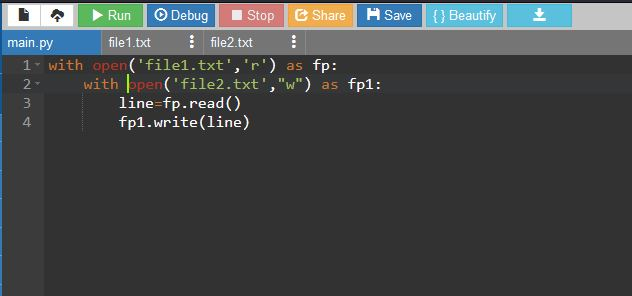

# copy-file
## AIM:
To write a python program for copying the contents from one file to another file.
## EQUIPEMENT'S REQUIRED: 
PC
Anaconda - Python 3.7
## ALGORITHM: 
### Step 1:
Create one text file with some contents and one empty file.
### Step 2: 
 Open the file which contains the content in reading mode and naming as file1

### Step 3: 
Then open the second empty file in append mode and name it as file2
### Step 4:  
Using for loop, read the contents from file1
### Step 5: 
To append contents to file2
### Step 6:
Now run the terminal and check whether the contents copied or not.

## PROGRAM:
```
with open('file1.txt','r') as fp: 
    with open('file2.txt',"w") as fp1:
        line=fp.read()
        fp1.write(line)
```

### OUTPUT:



## RESULT:
Thus the program is written to copy the contents from one file to another file.